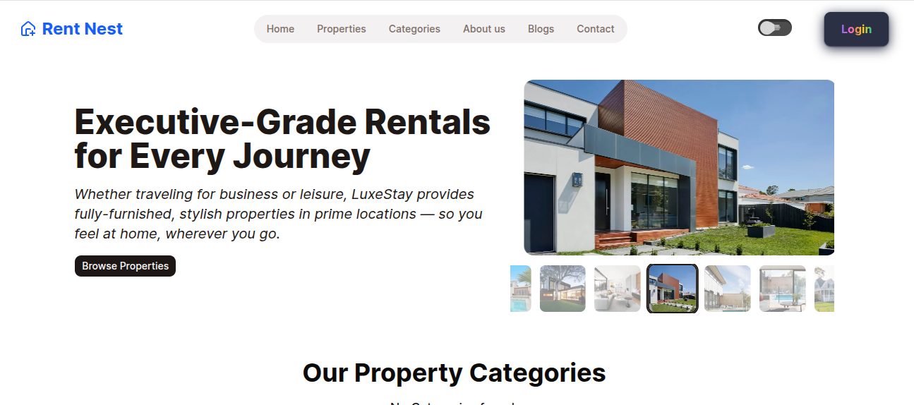
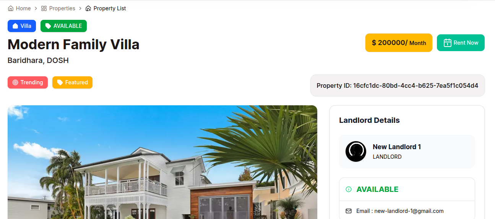
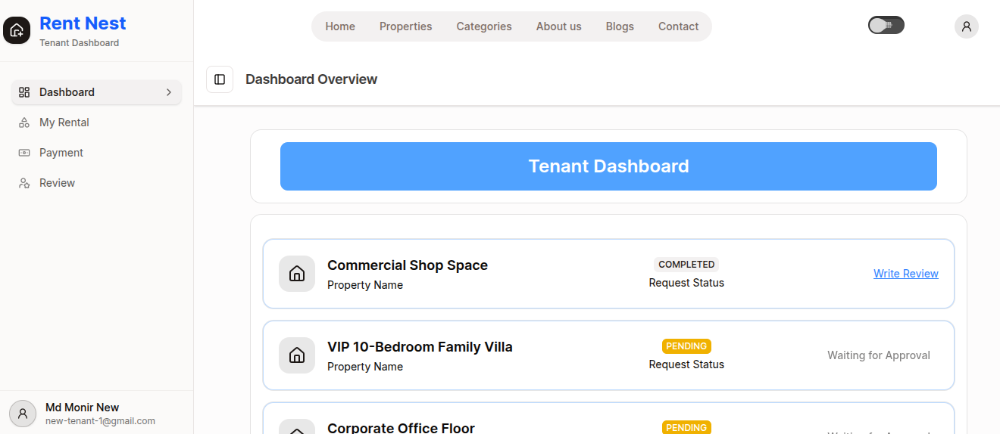
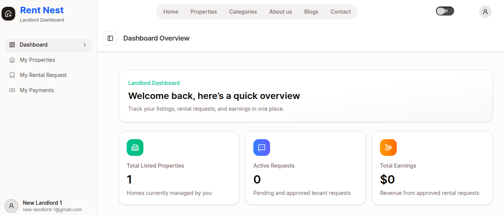
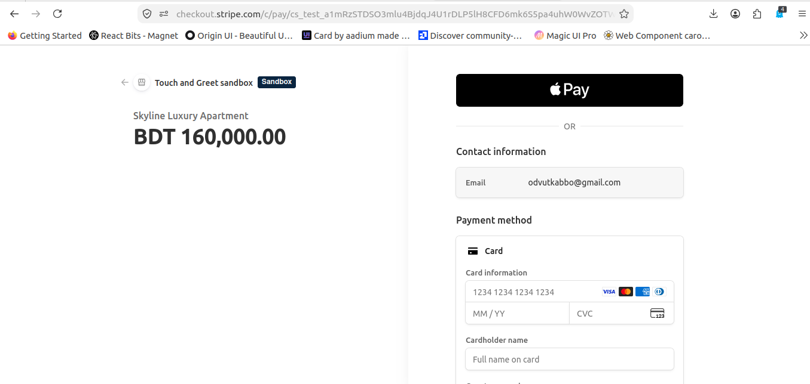
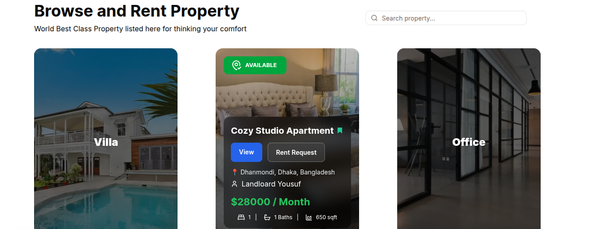

# 🏠 RentNest

<div align="center">


### A Modern Rental Property Management Platform

RentNest is a full-stack rental property marketplace that connects **Landlords** and **Tenants** through a modern, secure, and responsive web application. Users can browse properties, submit rental requests, complete secure online payments via Stripe, and manage rentals from role-based dashboards.

**Live Demo:** https://rentnest-seven.vercel.app

**Frontend Repository:** https://github.com/monirzkhan/rentnest-frontend

**Backend Repository:** https://github.com/monirzkhan/rentnest

</div>

---

# 📸 Screenshots

> Replace these placeholders with your screenshots.

| Home Page | Property Details |
|------------|------------------|
|  |  |

| Tenant Dashboard | Landlord Dashboard |
|------------------|--------------------|
|  |  |

| Payment | Properties |
|----------|------------|
|  |  |

---

# ✨ Features

## 👤 Authentication

- Secure JWT Authentication
- HTTP-only Cookie Authentication
- Role-based Authorization
- Login & Registration
- Protected Routes

---

## 🏡 Property Management

- Browse all available properties
- Property search
- Filter properties
- Pagination
- Property details page
- Landlord property management
- Create Property
- Update Property
- Delete Property

---

## 📄 Rental Request System

- Request property rental
- View rental request history
- Approve requests
- Reject requests
- Rental status tracking

---

## 💳 Stripe Payment Integration

- Secure Stripe Checkout
- Payment confirmation
- Payment history
- Automatic rental activation after successful payment

---

## ⭐ Reviews & Ratings

- Submit reviews
- Property ratings
- Tenant feedback
- Review listing

---

## 📊 Dashboard

### Tenant Dashboard

- My Rentals
- Rental Requests
- Payment History
- Reviews

### Landlord Dashboard

- Manage Properties
- Rental Requests
- Update Rental Status
- Earnings Overview

---

## 📱 Responsive Design

- Mobile Friendly
- Tablet Optimized
- Desktop Responsive
- Modern UI

---

# 🛠 Tech Stack

## Frontend

- Next.js 15 (App Router)
- React 19
- TypeScript
- Tailwind CSS
- Shadcn/UI
- Lucide React
- React Hook Form
- Zod
- Sonner
- Framer Motion
- Styled Components

---

## Backend

- Node.js
- Express.js
- TypeScript
- Prisma ORM
- PostgreSQL
- JWT Authentication
- Stripe API
- Cookie Parser
- Bcrypt

---

# 📂 Project Structure

```
src
│
├── app
├── components
├── hooks
├── lib
├── providers
├── services
├── actions
├── utils
└── middleware
```

---

# 🚀 Getting Started

## Clone Repository

```bash
git clone https://github.com/monirzkhan/rent-nest-frontend.git

cd rentnest-frontend
```

---

## Install Dependencies

```bash
npm install
```

---

## Environment Variables

Create a `.env.local` file.

```env
NEXT_PUBLIC_BACKEND_API_URL=http://localhost:5000/api

NEXT_PUBLIC_STRIPE_PUBLISHABLE_KEY=your_publishable_key
```

---

## Run Development Server

```bash
npm run dev
```

Open

```
http://localhost:3000
```

---

# 📡 API Integration

The frontend communicates with the backend REST API.

### Authentication

| Method | Endpoint |
|---------|----------|
| POST | /auth/login |
| POST | /users/register |
| POST | /auth/logout |
| GET | /users/me |

---

### Properties

| Method | Endpoint |
|---------|----------|
| GET | /properties |
| GET | /properties/:id |
| POST | /properties |
| PATCH | /properties/:id |
| DELETE | /properties/:id |

---

### Rental Requests

| Method | Endpoint |
|---------|----------|
| POST | /rental-requests |
| GET | /rental-requests/my |
| GET | /rental-requests/landlord |
| PATCH | /rental-requests/:id/status |

---

### Payments

| Method | Endpoint |
|---------|----------|
| POST | /payments/create |
| POST | /payments/confirm |
| GET | /payments/my |

---

### Reviews

| Method | Endpoint |
|---------|----------|
| POST | /reviews |
| GET | /reviews/property/:id |

---

# 🔐 Authentication Flow

```
Login
   │
   ▼
JWT Authentication
   │
HTTP-only Cookie
   │
Protected Routes
   │
Backend Validation
```

---

# 📦 Build

```bash
npm run build
```

---

# 🧪 Lint

```bash
npm run lint
```

---

# 🚀 Deployment

The application is deployed on **Vercel**.

```bash
npm run build
```

Deploy using:

- Vercel
- Netlify (Static)
- Docker (Optional)

---

# 📈 Future Improvements

- Google Authentication
- Email Verification
- Wishlist
- Notifications
- Chat System
- Admin Analytics
- Image Gallery
- Property Map Integration
- Multi-language Support

---

# 👨‍💻 Author

**Mohammad Moniruzzaman**

Frontend Developer

GitHub:
https://github.com/monirzkhan

LinkedIn:
https://linkedin.com/in/monirzkhan-dev

Portfolio:
https://mmonirz-dev.vercel.app

---

# 📄 License

This project is licensed under the MIT License.

---

<div align="center">

### ⭐ If you like this project, don't forget to star the repository!

Made with ❤️ using Next.js, TypeScript, Prisma, PostgreSQL, and Stripe.

</div>